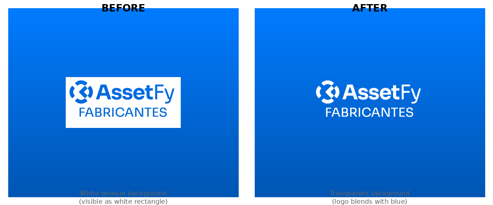

# Logo Transparency Fix

## Problem

The logo (`logo-blanco.png`) used in email notifications had a white opaque background, which was visible as a white rectangle when displayed on the blue gradient header of the notification email.

## Root Cause

The original logo file had:
- **81.3%** of pixels with white color and **full opacity** (alpha=255) - this was the background
- **16.5%** of pixels with white color and **full transparency** (alpha=0) - this was the letter content
- The alpha channel was inverted from what was needed

## Solution

Inverted the alpha channel of the logo so that:
- **Background pixels** (previously opaque white) → now **fully transparent** (alpha=0)
- **Letter pixels** (previously transparent) → now **fully opaque** (alpha=255)

## Technical Details

The logo is in **LA mode** (Luminance + Alpha):
- **Luminance**: All pixels remain white (255) - this is the color of the letters
- **Alpha**: Inverted so background is transparent

### After Fix
- Fully Transparent (background): **163,562 pixels (81.3%)**
- Fully Opaque (letters): **33,148 pixels (16.5%)**
- Partial Transparency (anti-aliasing): **4,517 pixels (2.2%)**

## Visual Comparison

**BEFORE**: White opaque background visible as a white rectangle on blue header
**AFTER**: Transparent background allows logo to blend seamlessly with blue gradient

## Implementation

The fix was applied to `/client/src/logo-blanco.png` using Python PIL to:
1. Load the original logo in LA mode
2. Split into luminance and alpha channels
3. Invert the alpha channel (255 - alpha for partial, 0 for opaque white background)
4. Merge back into LA mode and save

## Impact

The logo now displays correctly in email notifications with:
- ✅ White letters clearly visible on blue background
- ✅ No white rectangular box around the logo
- ✅ Smooth anti-aliased edges
- ✅ Professional appearance matching the email design

## Files Modified

- `client/src/logo-blanco.png` - Updated with transparent background version
